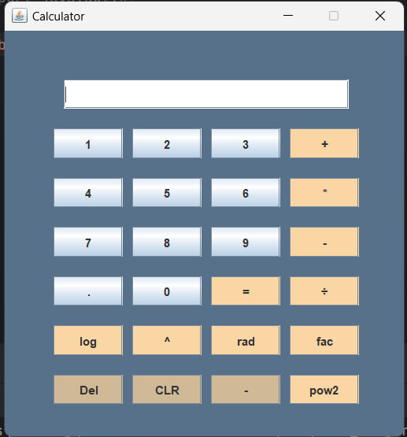

# Simple Calculator

A simple calculator implemented in Java with a graphical user interface.
<p align="center">
  
</p>
## Features

- Basic arithmetic operations: addition, subtraction, multiplication, and division.
- Simple and intuitive GUI for easy use.

## Installation

1. Clone the repository:
   ```sh
   git clone https://github.com/ghazalsf/Simple-Calculator-.git
2. Open the project in your preferred Java IDE.
3. Run the Main.java file to launch the calculator.

## Requirements
Java Development Kit (JDK) 8 or higher.
